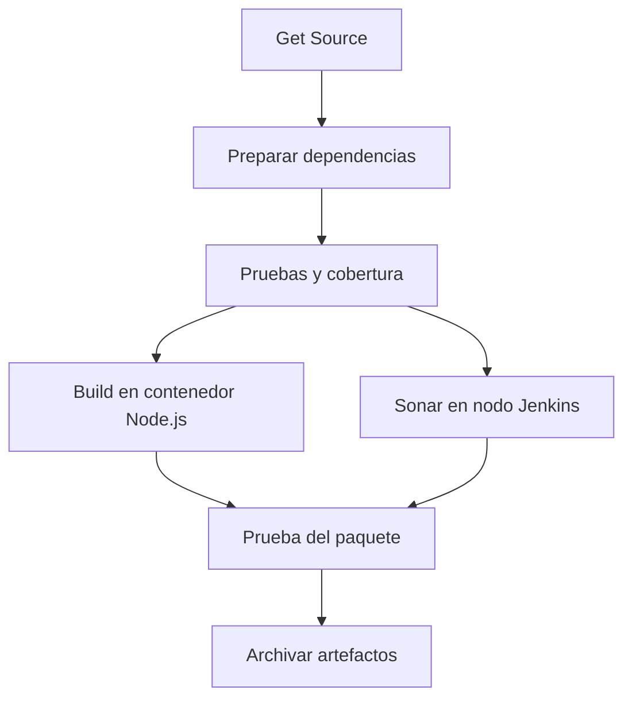

# Hito 4, paso 2 — Build y Sonar en paralelo

## Punto de partida

La ejecución #2 de Jenkins y el análisis secuencial fueron satisfactorios según
las capturas del usuario. SonarQube mostró Quality Gate Passed, cobertura del
100 %, cero issues abiertos en las categorías mostradas y duplicación del 0 %.

Este cambio reorganiza [Jenkinsfile](../Jenkinsfile); no modifica la API ni las
propiedades Sonar. Todavía no agrega `waitForQualityGate`, webhooks o publicación.
La guía del análisis secuencial describe el paso anterior, no el orden actual.

## Orden nuevo



- Las pruebas y LCOV terminan antes de empezar el bloque `parallel`.
- Build usa un contenedor Node.js 24 con `reuseNode true`; escribe el paquete en dist y utiliza archivos temporales fuera del workspace.
- Sonar hereda el nodo Jenkins del pipeline y conserva su acceso a `http://sonarqube:9000`; no ejecuta el scanner dentro del contenedor Node.
- Ambas ramas leen el mismo checkout. No reinstalar dependencias, limpiar el workspace ni regenerar cobertura dentro del bloque paralelo.
- La prueba del paquete abre otro contenedor Node.js sobre el mismo workspace después de que ambas ramas terminen correctamente. No vuelve a ejecutar `npm ci` en el workspace.
- Si una rama falla, la otra puede terminar, pero las etapas siguientes no se ejecutan. No se configura cancelación inmediata entre ramas en esta versión.
- `disableConcurrentBuilds` impide dos ejecuciones del job a la vez, no el paralelismo entre etapas de una misma ejecución.

## Comprobación local realizada

- 40 pruebas aprobadas, cobertura funcional del 100 %.
- Build y prueba del paquete aprobados.
- La huella SHA-256 de LCOV es idéntica antes y después de Build: el empaquetado no modifica el reporte que lee Sonar.
- Estas comprobaciones no ejecutan Jenkins ni Sonar localmente: la planificación real de agentes y el solapamiento se verifican en la EC2.

## Cómo reproducir y publicar

Desde la raíz del proyecto, en WSL:

```bash
npm run test:coverage
sha256sum coverage/lcov.info
npm run build
sha256sum coverage/lcov.info
npm run test:package
```

Las dos huellas deben coincidir. Después de revisar los cambios:

```bash
git add Jenkinsfile docs/sonar-paralelo.md
git commit -m "ci: ejecutar Build y Sonar en paralelo"
git push origin main
```

Usar para el push el entorno donde funciona el alias SSH del repositorio.
Estos comandos se ofrecen para ejecución del usuario; no se ejecutan automáticamente.

## Comprobar en Jenkins

1. Abrir el mismo job `proyecto-final-api` y pulsar Build Now.
2. Abrir Pipeline Overview: el bloque Build y Sonar debe tener dos ramas, no dos etapas consecutivas.
3. En Console Output, comprobar la entrada en `parallel` y las ramas Build y Sonar; sus mensajes pueden aparecer intercalados.
4. Comprobar que la prueba del paquete y el archivo de artefactos ocurren después de que terminen ambas ramas.
5. Comprobar SUCCESS y el nuevo análisis en SonarQube. Guardar captura del gráfico y revisar duraciones/horas de las ramas como evidencia de solapamiento.

La API es pequeña: Build puede terminar muy rápido. No añadir esperas artificiales
para aparentar paralelismo. Descargas, arranque de contenedores y recursos de EC2
pueden limitar cuánto trabajo se solapa; revisar consola y ejecutores si una rama
queda esperando. No aumentar recursos de pago automáticamente.

Jenkins aún no bloquea por Quality Gate. Una ejecución SUCCESS del scanner no
sustituye la aprobación del gate, que se incorporará en el próximo paso.
