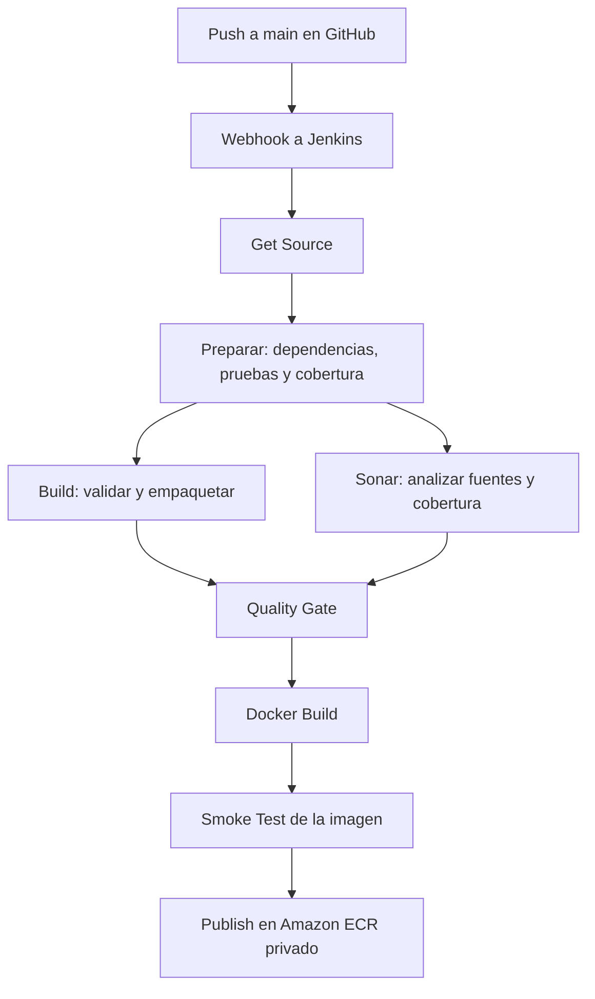

# Especificación — devops-final-api

## 1. Objetivo

Construir una API pequeña de tareas para demostrar un pipeline de integración
continua y entrega de una imagen Docker mediante Jenkins.

El objetivo principal es aprender y explicar el flujo CI/CD, no desarrollar una
aplicación de producción. Publicar una imagen es entrega de un artefacto; no
equivale a desplegar automáticamente la aplicación.

Estado (2026-10-02): especificación acordada; API, pruebas y documentación
implementadas y validadas localmente en WSL con Node.js 24.15.0. Build y prueba
del paquete también validados localmente. El pipeline y las integraciones remotas
todavía no están implementados.

## 2. Alcance y tecnologías

- JavaScript con Node.js 24 LTS y Express 5.
- npm como gestor de paquetes, con archivo de bloqueo versionado para que CI instale dependencias de forma reproducible mediante `npm ci`.
- Pruebas automatizadas con el ejecutor nativo de Node.js y cobertura con c8.
- Almacenamiento de tareas exclusivamente en memoria.
- Jenkins y SonarQube existentes en la EC2; no recrear sus servicios ni sus datos.
- Un job Jenkins y un proyecto SonarQube nuevos, separados de los laboratorios.
- ECR de AWS como destino inicial para la imagen.
- Repositorio GitHub: [devops-final-api](https://github.com/festrellaG/devops-final-api), rama `main`.

### Fuera del alcance

- Base de datos, autenticación, interfaz gráfica y usuarios.
- Kubernetes, alta disponibilidad y despliegue automático.
- Persistencia: al reiniciar el proceso se pierden las tareas.
- Exposición pública de una API con datos reales.
- Shared Library en la primera versión; se evaluará como mejora opcional.

## 3. Contrato de la API

Las respuestas serán JSON. La aplicación escuchará en el puerto configurado
mediante `PORT`, con valor predeterminado 3000, y en la interfaz `0.0.0.0` para
poder ejecutarse dentro de un contenedor.

### Modelo de tarea

| Campo | Tipo | Regla |
| --- | --- | --- |
| `id` | string | UUID generado por el servidor; no lo proporciona el cliente. |
| `title` | string | Obligatorio; se recortan espacios de los extremos; entre 1 y 120 caracteres después del recorte. |
| `completed` | boolean | Inicialmente `false`; solo se modifica mediante la actualización de la tarea. |

### Endpoints

| Método | Ruta | Comportamiento | Respuesta satisfactoria |
| --- | --- | --- | --- |
| GET | `/health` | Verificar que la API responde, sin consultar servicios externos. | 200 con `{ "status": "ok" }`. |
| GET | `/tasks` | Listar tareas en orden de creación. | 200 con un array; inicialmente `[]`. |
| POST | `/tasks` | Crear una tarea recibiendo únicamente `title`. | 201 con la tarea creada. |
| PATCH | `/tasks/:id` | Cambiar el estado recibiendo únicamente `completed`, de tipo boolean. | 200 con la tarea actualizada. |
| DELETE | `/tasks/:id` | Eliminar una tarea existente. | 204 sin cuerpo. |

### Validaciones y errores

- POST y PATCH requieren un objeto JSON, no un array ni `null`.
- Rechazar campos desconocidos para mantener explícito el contrato.
- POST: rechazar título ausente, no textual, vacío o superior a 120 caracteres.
- PATCH: rechazar `completed` ausente o que no sea boolean; no convertir strings como `"true"` automáticamente.
- Cuerpo inválido o JSON mal formado: 400.
- POST/PATCH con tipo de contenido distinto de `application/json`: 415.
- Limitar el cuerpo a 16 KiB; si se supera: 413.
- Identificador de tarea inexistente o mal formado: 404; ruta desconocida: 404.
- Errores con formato `{ "error": "Mensaje descriptivo" }`, excepto la respuesta 204, que no contiene cuerpo. No devolver trazas internas al cliente.

## 4. Diseño mínimo

- Separar la creación de la aplicación del proceso que abre el puerto.
- Cada instancia de la aplicación tendrá su propio almacenamiento en memoria; las pruebas no compartirán tareas entre sí.
- Separar validación y lógica de tareas cuando mejore la claridad, sin añadir capas innecesarias para este ejercicio.
- Cerrar el servidor de forma ordenada al recibir SIGTERM.
- No registrar secretos ni añadir credenciales al repositorio.

## 5. Pruebas y construcción

### Pruebas mínimas

- Health check y listado inicialmente vacío.
- Creación, recorte de espacios, identificador y estado inicial.
- Creación de varias tareas con identificadores diferentes.
- Actualización tanto a `true` como a `false`.
- Eliminación y comprobación de que la tarea ya no existe.
- Casos de validación, recurso inexistente y ruta desconocida.
- JSON mal formado, tipo de contenido incorrecto y límite de tamaño.
- Aislamiento entre instancias y cierre de los servidores usados en las pruebas.

La cobertura producirá un reporte LCOV para SonarQube. Objetivo inicial:
al menos 80 % en líneas, sentencias, funciones y ramas del código funcional de
la API. El archivo de arranque se probará adicionalmente mediante una comprobación
de la aplicación ejecutándose. Las exclusiones deberán ser pequeñas y justificadas.

### Qué significa Build en esta API

JavaScript no necesita compilarse como Java en este proyecto. El stage Build
validará la sintaxis y empaquetará el código de ejecución en un artefacto npm
`.tgz`, que Jenkins archivará. No será un simple mensaje de consola.

Ese artefacto contendrá únicamente los archivos necesarios para ejecutar la API,
no reportes, pruebas, credenciales ni dependencias instaladas. La imagen Docker
utilizará el código de ese paquete y las dependencias de producción instaladas
con el archivo de bloqueo del mismo commit.

Implementación local: `npm run build` genera el paquete en `dist` mediante
`npm pack`. Incluye una copia del lockfile como `npm-shrinkwrap.json` para que
viaje dentro del artefacto y permita instalar versiones exactas.
`npm run test:package` comprueba el contenido, instala solo dependencias de producción y
ejecuta la API extraída en un directorio temporal. Son operaciones independientes
de las pruebas unitarias y no publican nada.

## 6. Pipeline previsto

1. **Webhook:** GitHub notifica un push a `main`. Es el disparador, no un stage.
2. **Get Source:** checkout explícito del repositorio y registro del SHA utilizado. Evitar un checkout automático redundante en el workspace.
3. **Preparar:** instalar dependencias, ejecutar pruebas y generar cobertura. Si una prueba o el umbral de cobertura falla, detener la ejecución.
4. **Build y Sonar en paralelo:** Build genera el paquete; Sonar analiza los fuentes e importa la cobertura ya creada. Ninguna rama debe borrar o modificar archivos que la otra necesita. Esperar a que ambas terminen antes de continuar.
5. **Quality Gate:** esperar el resultado del servidor SonarQube y detener la publicación si no es satisfactorio. Un scanner exitoso no garantiza un gate aprobado.
6. **Docker Build:** crear una imagen de la API, no reconstruir la imagen de Jenkins.
7. **Smoke Test:** iniciar un contenedor temporal de la imagen y comprobar `/health` con un tiempo límite; retirar el contenedor incluso si falla la prueba.
8. **Publish:** obtener autorización temporal de ECR mediante un rol IAM y subir la imagen aprobada al repositorio privado de la cuenta AWS.

**Razón del stage Preparar:** Sonar necesita el reporte de cobertura terminado.
Generarlo antes evita una carrera entre las ramas sin incumplir el requisito de
ejecutar Build y Sonar en paralelo. Su orden en el diagrama no implica secuencia:
las dos ramas deben aparecer dentro de un bloque `parallel` real.

Evitar ejecuciones simultáneas del mismo job mientras se aprende y limitar la
duración y retención de ejecuciones. Esto no impide el paralelismo interno.

## 7. Integraciones y seguridad

### Direcciones basadas en el Compose del curso

- Acceso externo actual a Jenkins: puerto 8090 de la EC2.
- Jenkins hacia SonarQube en la red Compose: `http://sonarqube:9000`.
- GitHub hacia Jenkins: URL pública vigente más `/github-webhook/`; preferir HTTPS. El acceso HTTP actual del laboratorio no cifra el tráfico y no equivale a una configuración segura de producción.
- SonarQube hacia Jenkins: `http://jenkins:8080/sonarqube-webhook/` en la red Compose.
- Configurar y validar secretos compartidos para los webhooks.

Son dos webhooks diferentes: uno inicia el job y el otro comunica el resultado
del procesamiento en SonarQube. Si el scanner se ejecuta en otro contenedor o
agente, verificar su conectividad: no hereda automáticamente la red Compose.

### EC2 intermitente y presupuesto del laboratorio

- No reservar Elastic IP, contratar dominio ni crear balanceadores, NAT Gateway o servicios adicionales para estabilizar el webhook.
- Reutilizar la IPv4 pública asignada automáticamente a la EC2. Puede cambiar tras detener e iniciar la instancia; un reinicio normal no suele cambiarla.
- Al iniciar una sesión de laboratorio: encender EC2, comprobar que Jenkins está listo y consultar la IPv4 pública actual.
- Si cambió la IP, actualizar Payload URL en GitHub → Settings → Webhooks y Jenkins URL en Manage Jenkins → System → Jenkins Location. Con el acceso HTTP actual, el endpoint será `http://IP_PUBLICA_ACTUAL:8090/github-webhook/`.
- Mantener el acceso administrativo restringido. Para recibir el webhook, permitir únicamente los orígenes oficiales vigentes de GitHub para hooks en el puerto receptor, además de la IP propia para administración; no abrir todo el tráfico. Un Security Group filtra IP y puerto, no rutas HTTP.
- Configurar validación del secreto del webhook. La firma protege la integridad, pero no cifra HTTP. Resolver HTTPS antes de usar credenciales o datos sensibles sobre acceso público; no desactivar autenticación ni CSRF como atajo.
- Hacer el push de prueba con Jenkins encendido y la URL actualizada; verificar entrega y ejecución automática.
- Si Jenkins está apagado, el webhook falla. GitHub no reenvía automáticamente las entregas fallidas: cuando Jenkins vuelva, corregir la URL y reenviar la entrega desde Recent Deliveries, hacer un nuevo push o lanzar una ejecución manual. Una ejecución manual no demuestra el requisito de webhook.
- Para desarrollar la API y correr sus pruebas locales no hace falta encender EC2. Apagarla al terminar los ejercicios remotos, después de que finalicen los jobs.
- Esta estrategia evita recursos adicionales, pero NO garantiza costo cero: la IPv4 pública automática también puede generar cargos, y EBS y ECR pueden seguir consumiendo almacenamiento con EC2 detenida.
- Antes de publicar en ECR, verificar en Billing → Free Tier / Credits la cobertura, los créditos y su vencimiento para esta cuenta. No asumir que seis meses de plan gratuito cubren cualquier recurso. Si no está cubierto, detener ese hito y revisar una alternativa antes de aprovisionar.
- Mantener pocas imágenes pequeñas en ECR y acordar una política de retención. No borrar volúmenes de Jenkins/Sonar ni liberar recursos existentes sin confirmación. Las alertas de presupuesto no son un límite duro de gasto.

### Credenciales y ejecución

- Guardar el token de SonarQube y los secretos de validación de webhooks en Jenkins Credentials.
- Para ECR, preferir un rol IAM asociado a EC2 mediante un instance profile, sin claves AWS permanentes en Jenkins. Conceder `ecr:GetAuthorizationToken` sobre `*` y las acciones de publicación solo sobre el ARN del repositorio previsto; no conceder AdministratorAccess.
- Obtener un token de ECR al publicar mediante AWS CLI; su validez es de 12 horas y no debe guardarse como contraseña permanente de Jenkins. Autenticar contra el registry de la cuenta y región correctas y limpiar la configuración temporal después.
- Verificar AWS CLI y acceso del entorno de ejecución de Jenkins al rol mediante IMDSv2. Al estar en un contenedor, no asumir que funciona automáticamente; revisar red y hop limit sin desactivar IMDSv2. Un rol de instancia puede ser utilizado por otros procesos con acceso a sus credenciales, no solo por una etapa del pipeline.
- No usar tokens en URLs, argumentos visibles, archivos versionados o capturas.
- El alias SSH del equipo Windows no existe automáticamente dentro de Jenkins. Al ser público el repositorio, el checkout por HTTPS puede realizarse sin credencial.
- Limitar el uso del token de publicación a la etapa que lo necesita; usar autenticación no interactiva y limpiar la configuración temporal al terminar.
- Mantener protegidos los accesos administrativos; no abrir todos los puertos de EC2.
- El socket Docker montado en Jenkins permite controlar el host: ejecutar solo código de confianza. No añadir builds de PR externos con secretos de publicación.
- Verificar recursos de EC2 y versiones instaladas antes de cambiar infraestructura.

### Imagen de aplicación

- Utilizar una versión soportada de Node.js, alineada con pruebas y Build.
- Ejecutar la API como usuario no root y excluir dependencias de desarrollo.
- Etiquetar con número de ejecución y SHA corto para trazabilidad; no depender exclusivamente de `latest` ni reutilizar etiquetas versionadas deliberadamente.
- Publicar únicamente en el repositorio ECR privado previsto: `CUENTA_AWS.dkr.ecr.REGION.amazonaws.com/devops-final-api:ETIQUETA`.

## 8. Criterios de aceptación de la entrega

- [x] La API cumple el contrato y puede arrancar localmente.
- [ ] Las pruebas y los umbrales de cobertura pasan; un fallo bloquea el pipeline.
- [ ] Un push real a `main` dispara Jenkins sin pulsar Build Now.
- [ ] Get Source deja evidencia del commit procesado.
- [ ] Build y Sonar aparecen y se ejecutan en paralelo.
- [ ] Jenkins conserva el paquete y SonarQube muestra el análisis y la cobertura.
- [ ] Un Quality Gate no aprobado impide la publicación.
- [ ] La imagen se construye, pasa el smoke test y se publica en Amazon ECR privado, después de comprobar la cobertura de costos del plan.
- [ ] La etiqueta publicada permite relacionar imagen, ejecución y commit.
- [ ] No se publican secretos y los laboratorios anteriores permanecen intactos.
- [ ] La presentación explica el paso a paso con evidencia de una ejecución real.

## 9. Plan de trabajo y presentación

Implementar y comprobar por hitos, sin configurar todo a la vez:

La especificación es un documento de requisitos, no un programa que se ejecute.
Implementar únicamente el hito acordado, explicar los cambios, realizar una prueba
y revisar el resultado con el usuario antes de pasar al siguiente. No hacer commits,
pushes ni aprovisionar recursos de AWS automáticamente por estar descritos aquí.

1. Acordar esta especificación.
2. Implementar API, pruebas y documentación de uso; validarlas localmente.
3. Preparar y probar el Build local; después, con confirmación, publicar el código y crear un job Jenkins nuevo para Get Source y Build.
4. Configurar SonarQube, cobertura, paralelismo y Quality Gate.
5. Añadir construcción de imagen y smoke test; verificarlos antes de preparar IAM/ECR. Comprobar costos y, con confirmación, configurar publicación en ECR y probarla.
6. Configurar el webhook GitHub con la dirección vigente de EC2 y comprobar el flujo completo con un push. Documentar la actualización de URL tras un cambio de IP.
7. Preparar la presentación; considerar Shared Library como ampliación opcional.

### Resultado del hito 2 y punto de pausa

- API y validaciones implementadas; comprobación de sintaxis y pruebas satisfactorias.
- Cobertura local de la lógica de la API y del manejador de errores: 100 % en las cuatro métricas. El arranque se comprueba mediante pruebas de proceso real, incluido SIGTERM en WSL.
- Instrucciones de ejecución y prueba manual disponibles en [README.md](README.md).
- El bloqueo del pipeline ante fallos se verificará en Jenkins; las pruebas locales no demuestran todavía ese criterio.
- No se han creado recursos AWS, configurado Jenkins ni realizado commits o pushes en este hito.
- Pausa para que el usuario pruebe la API y revise los resultados antes del hito 3.

### Avance del hito 3: Build local

- Prueba manual del hito 2 confirmada por el usuario: creación 201 y listado correcto.
- Build genera el artefacto npm con fuentes y lockfile, sin dependencias instaladas ni secretos.
- Prueba del paquete aprobada: extracción aislada, instalación productiva, health, creación/listado y cierre.
- Las 40 pruebas de aplicación siguen aprobadas; cobertura funcional sin regresiones.
- Pendiente de este mismo hito: commit/push con confirmación y configuración del job Jenkins. No se ha completado aún el hito 3 remoto.

Guardar capturas sin secretos de: arquitectura, checkout y SHA, pruebas,
paralelismo, análisis y gate, construcción y prueba de imagen, etiqueta en ECR
y entrega del webhook con ejecución automática. Incluir también un ejemplo
de fallo controlado que impida publicar y explicar su corrección.

Pendiente de comprobar durante la implementación: versiones y nombres de las
herramientas Jenkins/Sonar, recursos y créditos de EC2, acceso seguro al webhook,
región y repositorio ECR, rol IAM y acceso desde Jenkins. Esta especificación no
afirma que ya estén configurados ni que su uso esté cubierto por el plan gratuito.
